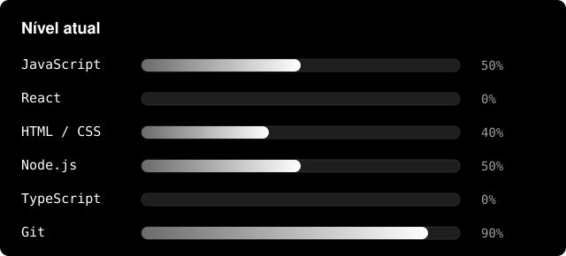
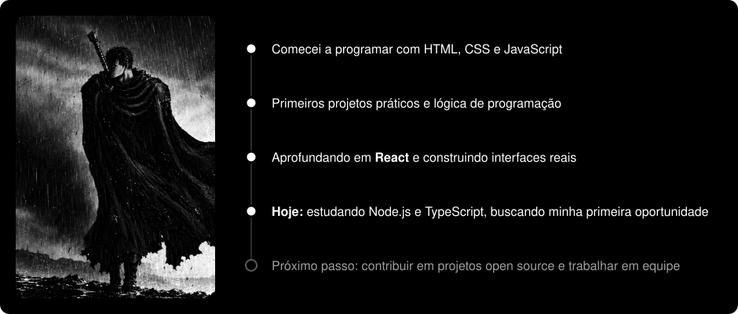

  

<h1 align="center"> Olá, eu sou o Vitor Francino</h1>

### Estudante de Engenharia de Software | Dev Web e Segurança Cibernética

Estou em busca de oportunidades como **desenvolvedor front-end / full-stack júnior**.
Gosto de transformar ideias em interfaces funcionais, entender como as coisas funcionam por baixo do capô, e estou expandindo meus estudos para a área de **segurança cibernética**.

-  Atualmente aprimorando projetos com **React** e **Node.js**
-  Estudando **TypeScript** e boas práticas de arquitetura front-end
-  Aberto a colaborar em projetos open source
-  Fique à vontade para abrir uma *issue* ou mandar uma mensagem por aqui mesmo no GitHub
-  Fun fact: aprendo melhor construindo do que lendo documentação

<table align="center">
  <tr>
    <td align="center" width="160">
       
      <b>Vitor Francino</b> 
      Nome
    </td>
    <td align="center" width="160">
       
      <b>Brasil</b> 
      País
    </td>
    <td align="center" width="160">
       
      <b>Estudante</b> 
      Nível
    </td>
  </tr>
  <tr>
    <td align="center" width="160">
       
      <b>PT • EN</b> 
      Nativo • Aprendendo
    </td>
    <td align="center" width="160">
       
      <b>Disponível</b> 
      Para oportunidades
    </td>
    <td align="center" width="160">
       
      <b>Dev e Segurança</b> 
      Objetivo
    </td>
  </tr>
</table>

---

###  Stack

  

---

###  Formação

Sou autodidata, com aprendizado baseado no estudo de documentações oficiais, na aplicação prática em projetos reais e na troca de conhecimentos com comunidades de tecnologia. Atualmente, concentro meus esforços no desenvolvimento contínuo das minhas habilidades técnicas e na construção de experiência prática na área de tecnologia. Ainda não possuo cursos ou certificações formais.

---

###  IA que eu uso no dia a dia

<table align="center">
  <tr>
    <td align="center" width="180">
       
      Lógica, código e revisão
    </td>
    <td align="center" width="180">
       
      Brainstorm e dúvidas rápidas
    </td>
  </tr>
  <tr>
    <td align="center" width="180">
       
      Pesquisa e integração Google
    </td>
    <td align="center" width="180">
       
      Tarefas técnicas e testes
    </td>
  </tr>
</table>

---

###  Minha evolução

  

---

###  Estatísticas

  
  

---

###  Snake

  <picture>
    <source media="(prefers-color-scheme: dark)" srcset="https://raw.githubusercontent.com/vitorfrancino4/vitorfrancino4/output/github-contribution-grid-snake-dark.svg" />
    <source media="(prefers-color-scheme: light)" srcset="https://raw.githubusercontent.com/vitorfrancino4/vitorfrancino4/output/github-contribution-grid-snake.svg" />
    
  </picture>

---

  

