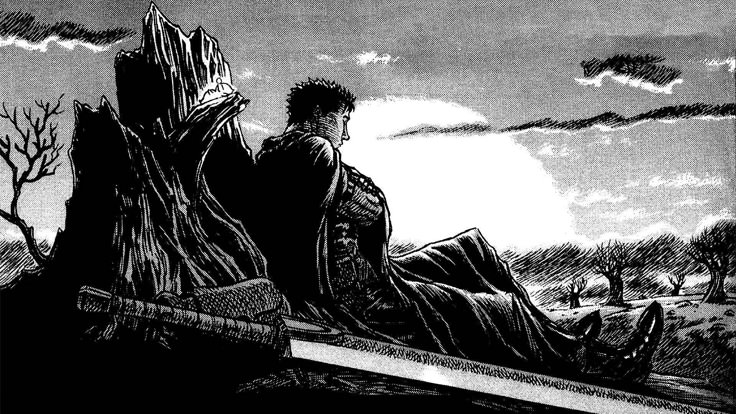

<p align="center">
  
</p>

<h1 align="center"> Olá, eu sou o Vitor Francino</h1>

### Estudante de Engenharia de Software | Dev Web e Segurança Cibernética

Estou em busca de oportunidades como **desenvolvedor front-end / full-stack júnior**.
Gosto de transformar ideias em interfaces funcionais, entender como as coisas funcionam por baixo do capô, e estou expandindo meus estudos para a área de **segurança cibernética**.

-  Atualmente aprimorando projetos com **React** e **Node.js**
-  Estudando **TypeScript** e boas práticas de arquitetura front-end
-  Aberto a colaborar em projetos open source
-  Fique à vontade para abrir uma *issue* ou mandar uma mensagem por aqui mesmo no GitHub
-  Fun fact: aprendo melhor construindo do que lendo documentação

<table align="center">
  <tr>
    <td align="center" width="160">
      <br/>
      <b>Vitor Francino</b><br/>
      <sub>Nome</sub>
    </td>
    <td align="center" width="160">
      <br/>
      <b>Brasil</b><br/>
      <sub>País</sub>
    </td>
    <td align="center" width="160">
      <br/>
      <b>Estudante</b><br/>
      <sub>Nível</sub>
    </td>
  </tr>
  <tr>
    <td align="center" width="160">
      <br/>
      <b>PT • EN</b><br/>
      <sub>Nativo • Aprendendo</sub>
    </td>
    <td align="center" width="160">
      <br/>
      <b>Disponível</b><br/>
      <sub>Para oportunidades</sub>
    </td>
    <td align="center" width="160">
      <br/>
      <b>Dev e Segurança</b><br/>
      <sub>Objetivo</sub>
    </td>
  </tr>
</table>

---

###  Stack


**Nível atual:**

```
JavaScript   █████░░░░░  50%
React        ░░░░░░░░░░  0%
HTML / CSS   ████░░░░░░  40%
Node.js      █████░░░░░  50%
TypeScript   ░░░░░░░░░░  0%
Git          █████████░  90%
```

---

###  Formação

Sou autodidata, com aprendizado baseado no estudo de documentações oficiais, na aplicação prática em projetos reais e na troca de conhecimentos com comunidades de tecnologia. Atualmente, concentro meus esforços no desenvolvimento contínuo das minhas habilidades técnicas e na construção de experiência prática na área de tecnologia. Ainda não possuo cursos ou certificações formais.

---

###  IA que eu uso no dia a dia

<table align="center">
  <tr>
    <td align="center" width="180">
      <br/>
      <sub>Lógica, código e revisão</sub>
    </td>
    <td align="center" width="180">
      <br/>
      <sub>Brainstorm e dúvidas rápidas</sub>
    </td>
  </tr>
  <tr>
    <td align="center" width="180">
      <br/>
      <sub>Pesquisa e integração Google</sub>
    </td>
    <td align="center" width="180">
      <br/>
      <sub>Tarefas técnicas e testes</sub>
    </td>
  </tr>
</table>

---

###  Minha evolução

<table>
  <tr>
    <td width="260" valign="top">
      
    </td>
    <td valign="top">

- Comecei a programar com HTML, CSS e JavaScript
- Primeiros projetos práticos e lógica de programação
- Aprofundando em **React** e construindo interfaces reais
- **Hoje:** estudando Node.js e TypeScript, buscando minha primeira oportunidade
- Próximo passo: contribuir em projetos open source e trabalhar em equipe

</td>
  </tr>
</table>

---

###  Estatísticas

<p align="center">
  
  
</p>

<p align="center">
  
</p>

---

###  Snake

<p align="center">
  <picture>
    <source media="(prefers-color-scheme: dark)" srcset="https://raw.githubusercontent.com/vitorfrancino4/vitorfrancino4/output/github-contribution-grid-snake-dark.svg" />
    <source media="(prefers-color-scheme: light)" srcset="https://raw.githubusercontent.com/vitorfrancino4/vitorfrancino4/output/github-contribution-grid-snake.svg" />
    
  </picture>
</p>

---

<p align="center">
  
</p>
